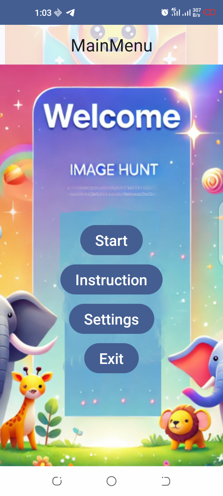
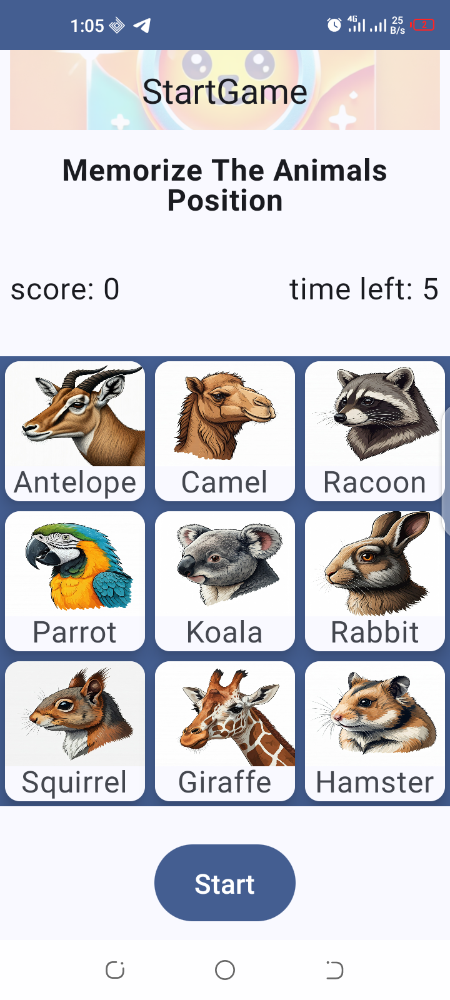
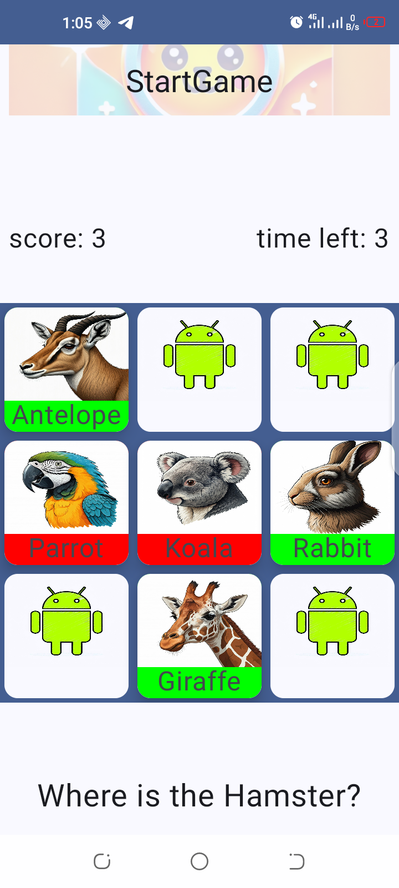
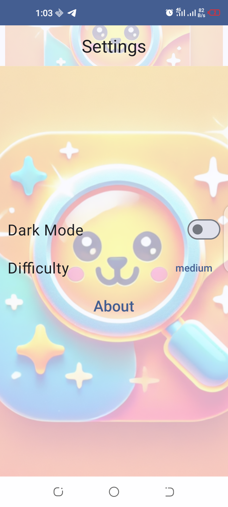
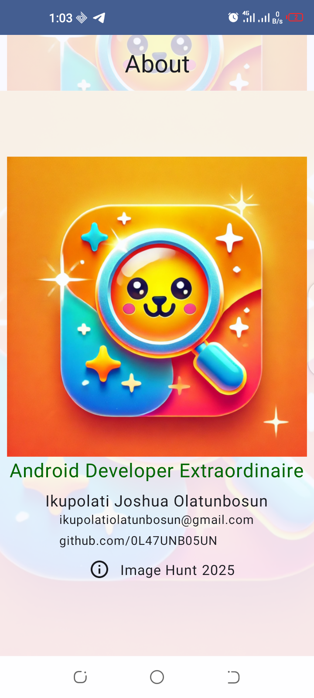
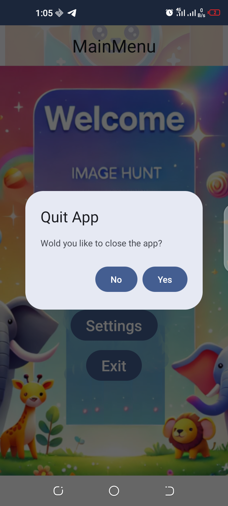

# Image Hunt

**Image Hunt** is a fun and interactive Android game built using Jetpack Compose. The game challenges players to test their memory by identifying the correct animal images after they've been flipped over. With increasing difficulty across three game modes, it’s an engaging way to sharpen your observation and decision-making skills.

---

## Gameplay Instructions

1. **Memorize** the positions of animal images displayed on the screen with their names below.
2. Press the **Start** button to flip all the images over, hiding the animals.
3. You’ll be asked to find a specific animal. Click on an image to reveal it:
   - **Green**: Correct choice.
   - **Red**: Incorrect choice.
4. Repeat the process until all animals are revealed.
5. Choose from **three game modes**, each featuring more images for increased difficulty.

---

## Features

- **Dynamic Gameplay**: Time-bound decisions (5 seconds per image) add a layer of challenge.
- **Multiple Modes**: Increasing difficulty with additional images in each mode.
- **Visual Feedback**: Intuitive red and green indicators for correct/incorrect answers.
- **Smooth Animations**: Seamless transitions and image flipping.

---

## What I Learned

While building Image Hunt, I enhanced my skills in the following areas:

- **ViewModel**: For managing and preserving UI-related data.
- **UI State Management**: Using `UiState` to handle game logic and updates.
- **Animations**: Adding smooth transitions for flipping images and displaying results.
- **LazyGridColumn**: Efficiently displaying a grid of images with Lazy composables.
- **Navigation**: Implementing navigation between game screens.
- **Drop-Down Menu**: Providing user-friendly game mode selection.

---

## Screenshots

\n
\n
\n
\n
\n
\n

---

## Installation

1. Clone this repository:
   ```bash
   git clone [<repository-url>](https://github.com/0L47UNB05UN/Image-Hunt)
   ```
2. Open the project in Android Studio.
3. Build and run the app on an emulator or a physical device.

---

## Contributing

Contributions are welcome! 
Feel free to fork the repository and submit a pull request.
